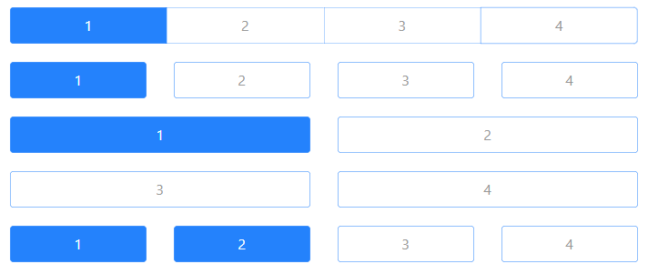

# vue-button-tab

> 一款基于 Vue 的按钮组件，适用于移动端和 PC 端。



## 安装

### npm

```sh
npm i vue-button-tab
```

### yarn

```sh
yarn add vue-button-tab
```

## 使用

```vue
<template>
    <button-tab v-model="data">
        <button-tab-item value="1">1</button-tab-item>
        <button-tab-item value="2">2</button-tab-item>
        <button-tab-item value="3">3</button-tab-item>
    </button-tab>
</template>

<script>
import { ButtonTab, ButtonTabItem } from 'vue-button-tab'

export default {
    components: {
        ButtonTab,
        ButtonTabItem,
    },

    data() {
        return {
            data: '1',
        }
    },
}
</script>
```

## 属性

### button-tab 属性

| 参数                 | 说明                                                                  | 类型                    | 默认值  |
| :------------------- | :-------------------------------------------------------------------- | :---------------------- | :------ |
| value / v-model      | 绑定值，在多选模式下为数组                                            | string / number / array | -       |
| multiple             | 是否开启多选模式                                                      | boolean                 | false   |
| column               | 列数，规定一行平均分配多少列,最多一行 24 列                           | number                  | -       |
| gutter               | 在布局只有一行的情况下可以通过该属性设置元素之间的间距                | number / string         | 0       |
| default-color        | 默认字体颜色                                                          | string                  | #999999 |
| active-color         | 选中时字体颜色                                                        | string                  | #FFFFFF |
| default-bg-color     | 默认背景颜色                                                          | string                  | #FFFFFF |
| active-bg-color      | 选中时背景颜色                                                        | string                  | #2482FC |
| default-border-color | 默认边框颜色                                                          | string                  | #2482FC |
| active-border-color  | 选中时边框颜色                                                        | string                  | #2482FC |
| items                | button-tab-item 数组，使用该属性后可以不用再引入 button-tab-item 组件 | array                   | []      |

### button-tab 事件

| 事件名        | 说明                     | 回调参数                |
| :------------ | :----------------------- | :---------------------- |
| on-item-click | 当选项被点击时触发的事件 | 当前点击项的 `value` 值 |

### button-tab-item 属性

| 参数  | 说明       | 类型            | 默认值 |
| :---- | :--------- | :-------------- | :----- |
| value | 选项的值   | string / number | -      |
| label | 选项的文本 | string          | -      |

详见[vue-button-tab](https://www.laiweijian.com/note/docs/Vue/button-tab.html)。
